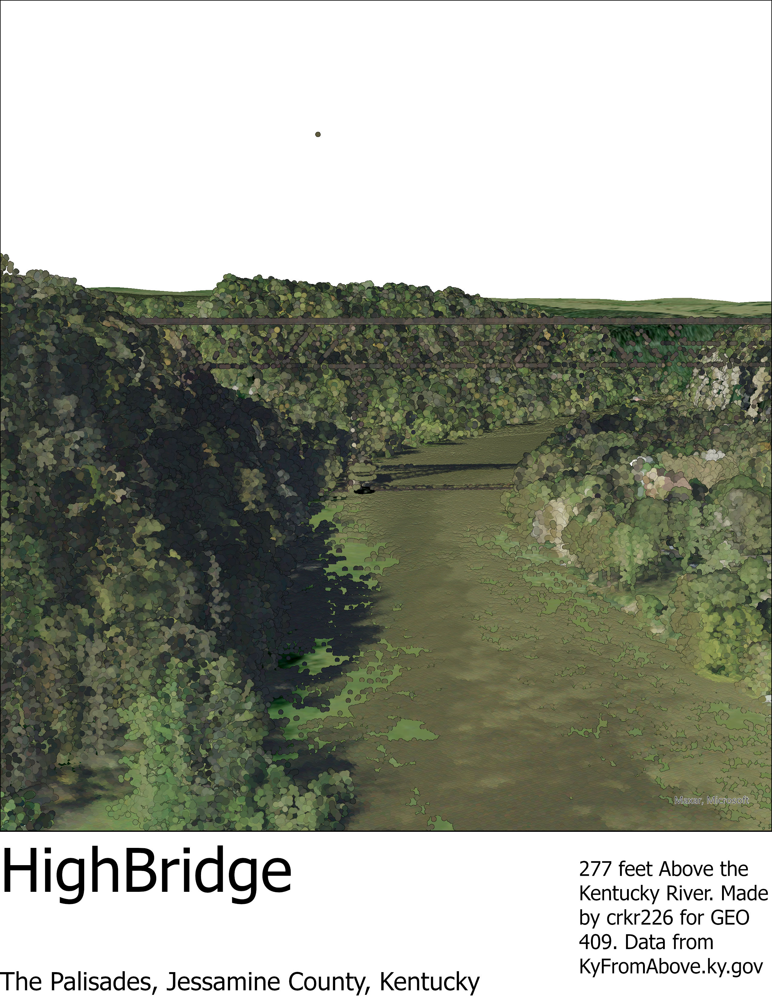

# Highbridge
The United States first Cantilever 
Bridge 277 Feet above the Kentucky River.
This bridge carried both passenger and freight trains through the Pallisades. 

   

   
UKy central campus canopy model – [Download geospatial PDF](campus-canopy-model.pdf)

Maps created by boydx for GEO409, Spring 2023, University of Kentucky Department of Geography
